## Course Logistic

* Every Wednesday 19:00 - 21:00
* Slides: http://nikolaypavlov.github.io/da-workshops-7/
* Skype Chat: https://join.skype.com/gjN0CfAd4bhg
* Reference Book: https://www.openintro.org/stat/textbook.php
* help(dchisq)
* Install the following packages: openintro

---
## Topics

* Inference for a single proportion
* Inference for two proportions
* Testing for goodness of fit using chi-square (special topic)

```{r, echo=F, include=F}
library(openintro)
```

--- 
## Inference for a single proportion


WSJ found that 82% of New Yorkers favored a “mandatory 21-day quarantine for anyone who has come in contact with an Ebola patient”. This poll included responses of 1042 NY adults in 2014. Construct a 95% confidence interval for this proportion.

* 1 - "success"
* 0 - "failure"
* $\widehat{p} = 0.82$ - sample proportion
* $p$ - population proportion

---
## Conditions for the sampling distibution of $\widehat{p}$:

The sampling distribution for $\widehat{p}$, taken from a sample of size $n$ from a population with a true proportion $p$, is nearly normal when:

* The sample observations are independent 
* We expected to see at least 10 successes and 10 failures in our sample, $np \geq 10, n(1-p) \geq 10$. This is called success-failure condition.

If this condition are met, then the sampling distribution of $\widehat{p}$ is nearly normal with mean $p$ and standard error

$SE_\widehat{p} = \sqrt{\frac{np(1-p)}{n^2}} = \sqrt{\frac{p(1-p)}{n}} = \sqrt{\frac{0.82(1-0.82)}{1042}} = 0.012$

Construct a 95% confidence interval for this proportion

```{r, echo=F, include=F}
ci <- 0.82 + c(-1.96, 1.96) * 0.012
```

---
## Hypothesis testing for a proportion

A simple random sample of 1,028 US adults in March 2013 found that 56% support nuclear arms reduction. Does this provide convincing evidence that a majority of Americans supported nuclear arms reduction at the $\alpha = 0.05$?

$H_0: p = 0.5, H_A: p > 0.5$

Success-Failure condition: $np_0 = n(1-p_0) = 1028 \times 0.5 = 514 > 10$

$SE = \sqrt{\frac{p_0(1 - p_0)}{n}} = \sqrt{\frac{0.5(1-0.5)}{1028}} = 0.016$

$Z = \frac{\text{point estimate} - \text{null proportion}}{SE} = \frac{0.56 - 0.5}{0.016} = 3.75$

$\text{p-value} = 0.0001$

---
## Difference of two proportions

The difference $\widehat{p_1} - \widehat{p_2}$ tends to follow a normal model when:

* each proportion separately follows a normal model
* the two samples are independent of each other

$SE_{\widehat{p_1} - \widehat{p_2}} = \sqrt{SE_\widehat{p_1}^2 + SE_\widehat{p_2}^2} = \sqrt{\frac{p_1(1-p_1)}{n_1} + \frac{p_2(1 - p_2)}{n_2}}$

---
## Hypothesis tests for $p_1 - p_2$


A quadcopter company is considering a new manufacturer for rotor blades. The new manufacturer would be more expensive but their higher-quality blades are more reliable, resulting in fewer warranty claims. If there is strong evidence of a more than 3% improvement in the percent of blades that pass inspection, management says they will switch suppliers, otherwise they will maintain the current supplier. 

Set up appropriate hypotheses for the test:

$H_0: p_{highQ} - p_{standard} = 0.03$

$H_A: p_{highQ} - p_{standard} > 0.03$

---
## Exercise

The quality control engineer collects a sample of blades, examining 1000 blades from each company and finds that 899 blades pass inspection from the current supplier and 958 pass inspection from the prospective supplier. 

* Calculate $SE$
* Find Z-score
* Evaluate the hypothesis setup at $\alpha = 0.05$

```{r, echo=F, include=F}
quad_se <- sqrt(0.958*(1-0.958) / 1000 + 0.899 * (1 - 0.899) / 1000)
quad_z <- (0.059 - 0.03) / 0.0114
quad_p <- 1 - pnorm(quad_z)
```

---
## Goodness of fit test

* Determine if the sample is representative of the general population
* Evaluate whether data resemble a particular distribution, such as a normal distribution or a geometric distribution

---
## Example

If these jurors are racially representative of the population? 

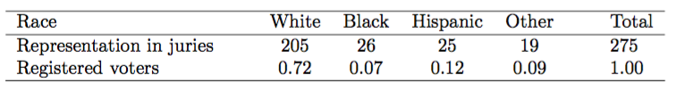

If the jury is representative of the population, then the proportions in the sample should roughly reflect the population of eligible jurors, i.e. registered voters. 

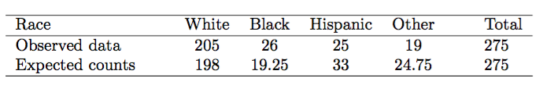

$H_0:$ The jurors are a random sample, i.e. there is no racial bias

$H_A:$ The jurors are not randomly sampled, i.e. there is racial bias

---
## Chi-square test for one-way table

$\chi^2 = \frac{(O_1 - E_1)^2}{E_1} + \frac{(O_2 - E_2)^2}{E_2} + \dotsc + \frac{(O_k - E_k)^2}{E_k}$

* Any difference that is squared will now be positive
* Differences that already look unusual – will become much larger after being squared

$\chi^2 = \frac{(205 - 198)^2}{198} + \frac{(26 - 19.25)^2}{19.25} + \frac{(25 - 33)^2}{33} + \frac{(19 - 24.75)^2}{24.75} = 5.89$

---
## Chi-square distribution

Characterize data sets and statistics that are always positive and typically right skewed

```{r, fig.height = 4.5, fig.width = 8}
curve(dchisq(x, df=2), 0, 30, n = 1000, lwd=2, ylab = "Density", xlab="Chi-square statistics")
curve(dchisq(x, df=5), 0, 30, n = 1000, add=T, lty=2, lwd=2)
curve(dchisq(x, df=10), 0, 30, n = 1000, add=T, lty=3, lwd=2)
legend("topright", c("df=2", "df=5", "df=15"), lty=c(1,2,3))
```

---
## Finding a p-value for a chi-square distribution

```{r}
jury_p <- 1 - pchisq(5.89, df=4-1)
jury_p 
```

We fail to reject null hypothesis with such a large p-value

### Conditions

* Each case that contributes a count to the table must be independent of all the other cases in the table
* Each particular scenario (i.e. cell count) must have at least 5 expected cases

--- 
## Exercise: Rock, Paper, Scissors


Whether players choose between these three options randomly, or if certain options are favored above others?

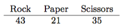

1. What are appropriate hypotheses for such a test?
2. Compute expected values
3. Compute the chi-square test statistic
4. Evaluate whether to reject the null hypothesis

```{r, echo=F, include=F}
rps_test <- chisq.test(c(43, 21, 35))
```

---
## Example: S&P500 daily

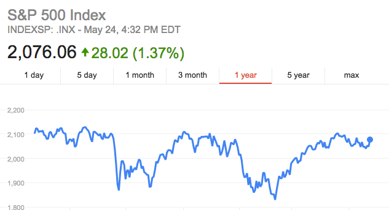

Daily stock returns from the S&P500 for 1990-2011 can be used to assess whether stock activity each day is independent of the stock’s behavior on previous days.

---
## Example: S&P500 daily

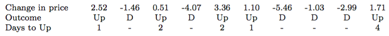

If the days really are independent, then the number of days until a positive trading day should follow a geometric distribution.

### Number of waiting days for a positive trading day during 1990-2011

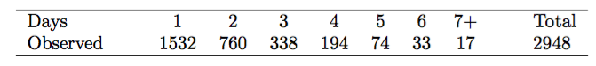

---
## Example: S&P500 daily

$H_0:$ The stock market being up or down on a given day is independent from all other days. We will consider the number of days that pass until an Up day is observed. Under this hypothesis, the number of days until an Up day should follow a geometric distribution.

$H_A:$ The stock market being up or down on a given day is not independent from all other days. Since we know the number of days until an Up day would follow a geometric distribution under the null, we look for deviations from the geometric distribution, which would support the alternative hypothesis.

---
## Example: S&P500 daily

1. Identify the null proportion associated with each bin
2. Multiply each null proportion by the total count to obtain the expected counts

The S&P500 was positive ("Up") on 53.2% of those days

$P(D) = (1 - 0.532)^{D-1} \times 0.532$

$P(3) = (1 - 0.532)^2 \times 0.532 = 0.1165$

$E(3) = 0.1165 \times 2968 = 343$

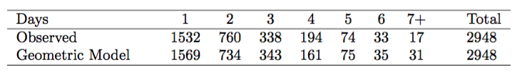

---
## Example: S&P500 daily

```{r, fig.height = 6, fig.width = 8}
sp500 <- data.frame(observed=c(1532, 760, 338, 194, 74, 33, 17), 
                    expected=c(1569, 734, 343, 161, 75, 35, 31))
barplot(t(sp500), beside=T, names.arg=1:7, ylab="Frequency", xlab="Wait until positive day")
```

--- 
## Example: S&P500 daily

$\chi^2 = \frac{(1532 - 1569)^2}{1569} + \frac{(760 - 734)^2}{734} + \frac{(338 - 343)^2}{343} + \frac{(194 - 161)^2}{161} + \\ + \frac{(74 - 75)^2}{75} + \frac{(33 - 35)^2}{35} + \frac{(17 - 31)^2}{31} = 15.08$

```{r}
sp500_p <- 1 - pchisq(15.08, df=7-1)
sp500_p
```

We have sufficient evidence to reject the notion that the wait times follow a geometric distribution, i.e. trading days are not independent and past days may help predict what the stock market will do today.

---
## Testing for independence in two-way tables

Google is constantly running experiments to test new search algorithms. For example, Google might test three algorithms using a sample of 10,000 google.com search queries. Whether there is a difference in the performance of the algorithms?

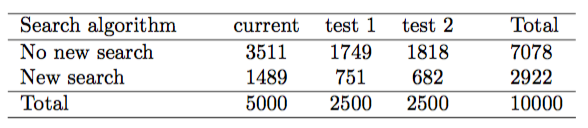

$H_0:$ The algorithms each perform equally well

$H_A:$ The algorithms do not perform equally well

In other words the goal is to check whether the search variable is independent of the algorithm variable.

---
## Expected counts in two-way tables

From the experiment, we estimate the proportion of users who were satisfied with their initial search (no new search) as $7078/10000 = 0.7078$

If there really is no difference among the algorithms, about 70.78% of the 5000 would be satisfied with the initial search or $0.7078 \times 5000 = 3539$

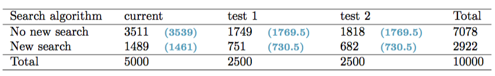

$E_{i,j} = \frac{(\text{row i total}) \times (\text{column j total})}{\text{table total}}$

---
## The chi-square test for two-way tables

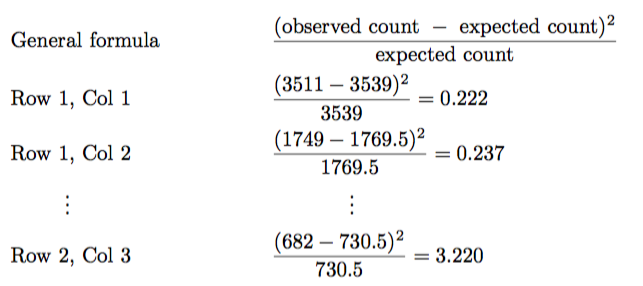

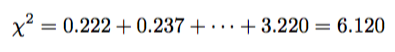

---
## Computing degrees of freedom and p-value for a two-way table

$df = (R-1) * (C - 1)$

```{r}
goog_p <- 1 - pchisq(6.120, df=(2-1) * (3-1))
goog_p
```

That is, the data provide convincing evidence that there is some difference in performance among the algorithms.

---
## Exercise: Approval ratings


We would like to determine if there are actually differences in the approval ratings of Barack Obama, Democrats in Congress, and Republicans in Congress. 

```{r}
addmargins(table(gov.poll), c(1,2))
```

---
## Exercise: Approval ratings

1. What are appropriate hypotheses for such a test?
2. Compute expected values
3. Compute the chi-square test statistic
4. Evaluate whether to reject the null hypothesis

Hint: see chisq.test() functions

```{r, echo=F, include=F}
rating_test <- chisq.test(table(gov.poll))
```

---
## Homework

* [Lab 7 - Inference for categorical data](http://htmlpreview.github.io/?https://github.com/andrewpbray/oiLabs-base-R/blob/master/inf_for_categorical_data/inf_for_categorical_data.html)
* Skype Chat for discussions: https://join.skype.com/gjN0CfAd4bhg
* Reading: OpenIntro Statistics Chapter 6
* Reference Book: https://www.openintro.org/stat/textbook.php
* help(dchisq), help(chisq.test)